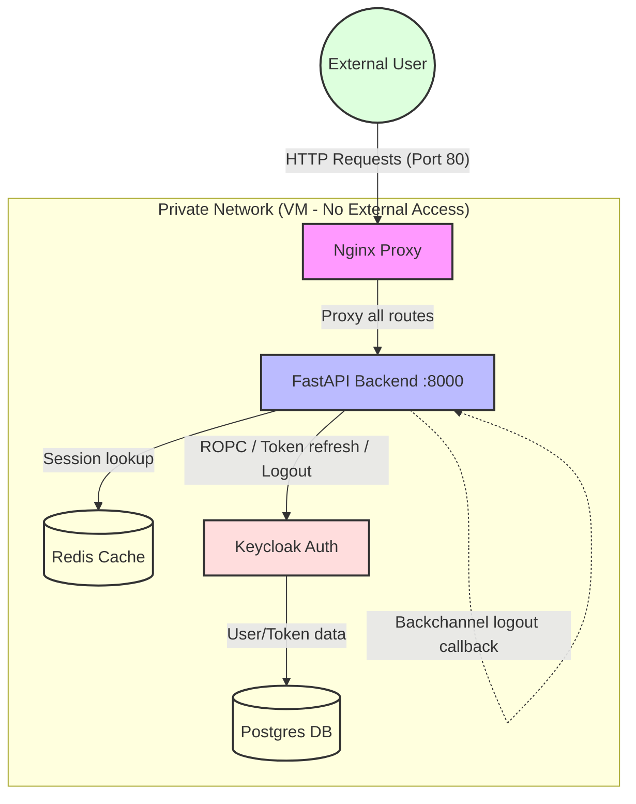
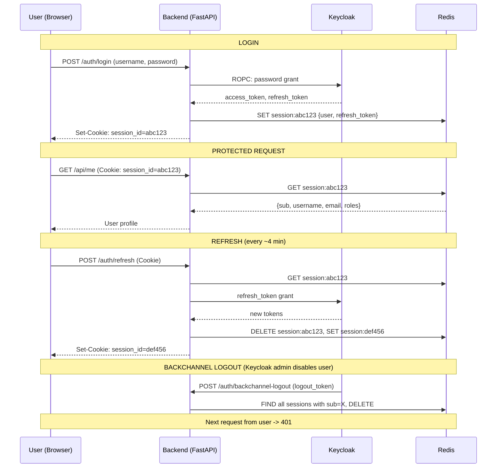

# How the App Works (Architecture)

This project uses a **BFF (Backend-for-Frontend)** setup. The backend acts as a security guard between the frontend and Keycloak.

## 1. Flow Diagram (The Big Picture)



## 2. Authentication Flow (Step-by-Step)

### Login
1.  **User sends password**: Frontend sends `username` + `password` to `POST /auth/login`
2.  **Backend calls Keycloak**: Server-to-server POST using ROPC (password grant)
3.  **Keycloak returns tokens**: `access_token`, `refresh_token`, `id_token`
4.  **Backend extracts user info**: Decodes JWT to get `sub`, `username`, `email`, `roles`
5.  **Backend creates session in Redis**: Stores user data + `kc_refresh_token` with 24h TTL
6.  **Backend sets cookie**: HTTP-only `session_id` cookie (browser never sees JWTs)

### Refresh (every ~4 min from frontend)
1.  Frontend calls `POST /auth/refresh` with session cookie
2.  Backend retrieves `kc_refresh_token` from Redis
3.  Backend calls Keycloak `refresh_token` grant for new tokens
4.  **Session rotation**: New session ID created, old session deleted, new cookie set

### Logout (from app)
1.  Frontend calls `POST /auth/logout`
2.  Backend revokes `kc_refresh_token` at Keycloak logout endpoint
3.  Backend deletes Redis session
4.  Backend clears session cookie

### Backchannel Logout (from Keycloak admin or another client)
1.  Admin disables user or logs out from Keycloak console
2.  Keycloak sends `logout_token` to `POST /auth/backchannel-logout`
3.  Backend finds all Redis sessions for that user (`sub`)
4.  Backend deletes all matching sessions
5.  Next request from that user fails with 401



## 3. Why is this safe?
*   **Keycloak not exposed**: Bound to `127.0.0.1:8080` - only accessible from within the VM
*   **Redis not exposed**: Bound to `127.0.0.1:6379` - only accessible from within the VM
*   **Only Nginx public**: Port 80 is the single entry point
*   **JWTs never reach browser**: Stored server-side in Redis; browser only sees random session ID
*   **Session rotation**: Each refresh creates new session ID, preventing session fixation
*   **Backchannel logout**: Keycloak can invalidate backend sessions when admin disables a user

## 4. Folder Structure

```
apps/backend/
├── app/
│   ├── __init__.py
│   ├── main.py                     # FastAPI app factory (thin - imports and assembles)
│   │
│   ├── core/                       # App-wide configuration and setup
│   │   ├── __init__.py
│   │   ├── config.py               # pydantic-settings (reads .env)
│   │   ├── database.py             # SQLAlchemy engine, session, init_db
│   │   ├── lifespan.py             # startup/shutdown lifecycle
│   │   └── limiter.py              # slowapi rate limiter config
│   │
│   ├── middleware/                  # HTTP middleware
│   │   ├── __init__.py
│   │   └── logging.py              # Request timing logger
│   │
│   ├── models/                     # SQLAlchemy ORM models
│   │   ├── __init__.py
│   │   └── base.py                 # Declarative Base
│   │
│   ├── schemas/                    # Pydantic request/response schemas
│   │   ├── __init__.py
│   │   └── auth.py                 # Auth schemas (UserResponse, LoginRequest, etc.)
│   │
│   ├── services/                   # External service integrations
│   │   ├── __init__.py
│   │   ├── session.py              # Redis client + session CRUD
│   │   └── keycloak.py             # Keycloak HTTP calls (token, refresh, revoke, JWKS)
│   │
│   ├── auth/                       # Authentication logic
│   │   ├── __init__.py
│   │   ├── dependencies.py         # get_current_user FastAPI dependency
│   │   └── routes.py               # /auth/login, /auth/refresh, /auth/logout, /auth/backchannel-logout
│   │
│   └── utils/                      # Shared utility functions
│       ├── __init__.py
│       └── jwt.py                  # get_user_info_from_token()
│
├── .env                            # Environment variables (not committed)
├── .env.example                    # Template for .env
├── Dockerfile
├── pyproject.toml
└── uv.lock

infra/                              # Infrastructure (Docker)
├── .env                            # Root: postgres + keycloak admin creds
├── docker-compose.yml              # Root: includes all services
├── backend/
│   ├── .env
│   ├── Dockerfile
│   └── docker-compose.yml
├── keycloak/
│   ├── .env
│   ├── Dockerfile
│   └── docker-compose.yml
├── nginx/
│   ├── .env
│   ├── Dockerfile
│   ├── conf.d/default.conf
│   └── docker-compose.yml
└── redis/
    ├── .env
    ├── Dockerfile
    └── docker-compose.yml
```

## 5. Where to find things

| Need to change... | Go to... |
|---|---|
| Add a new env var | `core/config.py` |
| Change database setup | `core/database.py` |
| Add startup/shutdown logic | `core/lifespan.py` |
| Change rate limits | `core/limiter.py` |
| Add a new middleware | `middleware/` (new file + register in `main.py`) |
| Add a new ORM model | `models/` (new file + add to `__init__.py`) |
| Add a new Pydantic schema | `schemas/` (new file + add to `__init__.py`) |
| Add a new external API client | `services/` (new file) |
| Add a new auth endpoint | `auth/routes.py` |
| Add a new protected dependency | `auth/dependencies.py` |
| Add a utility/helper | `utils/` (new file) |
