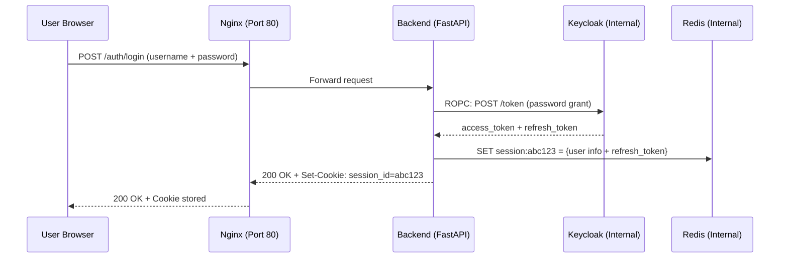
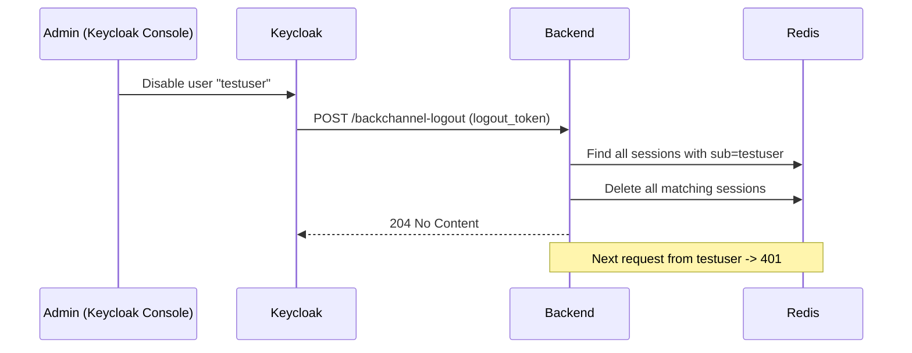

# Authentication Flow Guide

Complete explanation of how authentication works in this project, step by step.

---

## The Big Picture

```
User (Browser)
    |
    |  HTTP request
    v
+-----------+
|   Nginx   |  Port 80 - only public door
+-----+-----+
      |
      |  forwards to localhost:8000
      v
+-----------+
|  Backend  |  FastAPI on port 8000
+-----+-----+
      |
      |  internal HTTP calls
      +---> Keycloak (port 8080)  <- never seen by browser
      +---> Redis (port 6379)     <- never seen by browser
```

**Key rule:** The browser NEVER talks to Keycloak or Redis directly. It only talks to Nginx on port 80.

---

## How Login Works

### Step 1: User submits credentials

The user types their username and password in the frontend. The frontend sends them to the backend:

```
POST http://your-server/auth/login?username=testuser&password=password
```

### Step 2: Backend calls Keycloak

The backend receives the username and password. It makes a **server-to-server** call to Keycloak:

```
POST http://keycloak:8080/realms/attendance-app/protocol/openid-connect/token

Body (form-encoded):
  grant_type: password
  client_id: backend-client
  client_secret: best-practice-secret-12345
  username: testuser
  password: password
  scope: openid profile email offline_access
```

This is called **ROPC** (Resource Owner Password Credentials) — the backend sends the password directly to Keycloak. The browser never sees Keycloak's URL.

### Step 3: Keycloak validates and returns tokens

If the username and password are correct, Keycloak returns three tokens:

| Token | Purpose |
|-------|---------|
| `access_token` | Proves who the user is (expires in ~5 minutes) |
| `refresh_token` | Used to get new access tokens without re-login (expires in ~30 minutes to days) |
| `id_token` | Contains user identity info (not used directly) |

### Step 4: Backend extracts user info

The backend reads the `access_token` (it's a JWT) to get:
- `sub` — unique user ID
- `username` — login name
- `email` — email address
- `roles` — list of permissions

### Step 5: Backend creates a session in Redis

The backend stores this data in Redis:

```
Key:    session:qChQ02pX9drHxDakrjnCC0ovX02B7byfEt3lD3zEZPY
Value:  {
          "sub": "2a0a2f4c-...",
          "username": "testuser",
          "email": null,
          "roles": ["default-roles-attendance-app", ...],
          "kc_refresh_token": "<long-refresh-token>"
        }
TTL:    24 hours (auto-deletes after)
```

The key is a random 32-byte string. Nobody can guess it.

### Step 6: Backend sets a cookie

The backend sends back a `Set-Cookie` header:

```
Set-Cookie: session_id=qChQ02pX9drHxDakrjnCC0ovX02B7byfEt3lD3zEZPY;
            HttpOnly;
            Path=/;
            SameSite=lax;
            Max-Age=86400
```

Important flags:
- **HttpOnly** — JavaScript cannot read this cookie (prevents XSS theft)
- **SameSite=lax** — Cookie only sent on same-site requests (prevents CSRF)
- **Max-Age=86400** — Cookie expires in 24 hours

### What the browser stores

The browser ONLY stores the random `session_id` cookie. It never sees any JWTs, tokens, or passwords.



---

## How Protected Requests Work

### Step 1: User requests data

The browser wants to access a protected endpoint, like `/api/me`. It automatically sends the cookie:

```
GET http://your-server/api/me
Cookie: session_id=qChQ02pX9drHxDakrjnCC0ovX02B7byfEt3lD3zEZPY
```

### Step 2: Backend checks the session

The backend runs `get_current_user` which:
1. Reads `session_id` from the cookie
2. Looks it up in Redis: `GET session:qChQ02pX9drHxDakrjnCC0ovX02B7byfEt3lD3zEZPY`
3. If found, returns the user data
4. If not found (expired or wrong), returns `401 Unauthorized`

### Step 3: Response sent back

If valid:
```json
{
  "sub": "2a0a2f4c-...",
  "username": "testuser",
  "email": null,
  "roles": ["default-roles-attendance-app", "offline_access", "uma_authorization"]
}
```

---

## How Session Refresh Works

Access tokens from Keycloak expire in ~5 minutes. The backend stores the refresh token in Redis and uses it to get new tokens.

### Step 1: Frontend calls refresh

Every ~4 minutes, the frontend calls:

```
POST http://your-server/auth/refresh
Cookie: session_id=qChQ02pX9drHxDakrjnCC0ovX02B7byfEt3lD3zEZPY
```

### Step 2: Backend uses stored refresh token

1. Reads old `session_id` from cookie
2. Looks up session in Redis to get `kc_refresh_token`
3. Sends `kc_refresh_token` to Keycloak to get new tokens
4. Keycloak returns new `access_token` + new `refresh_token`

### Step 3: Session rotation (security feature)

The backend does **session rotation**:
1. Creates a **new** session with a **new** random session ID
2. Stores the new refresh token
3. **Deletes** the old session from Redis
4. Sends back a **new** cookie with the new session ID

```
Old: session_id=qChQ02pX9drHxDakrjnCC0ovX02B7byfEt3lD3zEZPY  ← DELETED
New: session_id=1GPstiyZBexFSI8j5BqgnN26xsF3JHiUtL3wb4q6iOA  ← ACTIVE
```

**Why?** If someone steals your old session ID, it becomes useless after the next refresh. This prevents session fixation attacks.

---

## How Logout Works (From the App)

### Step 1: Frontend calls logout

```
POST http://your-server/auth/logout
Cookie: session_id=1GPstiyZBexFSI8j5BqgnN26xsF3JHiUtL3wb4q6iOA
```

### Step 2: Backend does three things

1. **Revokes the refresh token at Keycloak** — Tells Keycloak "this token is no longer valid"
2. **Deletes the session from Redis** — Removes the session data
3. **Clears the cookie** — Sends `Set-Cookie: session_id=; Max-Age=0`

### Result

- The cookie is gone from the browser
- The session is gone from Redis
- The refresh token is revoked at Keycloak
- Even if someone captured the old session ID, it's useless everywhere

---

## How Backchannel Logout Works (From Keycloak)

This is the most important security feature. It handles the case where an admin disables a user or logs them out from the Keycloak admin console.

### Scenario: Admin disables a user in Keycloak

1. Admin goes to Keycloak console → disables user `testuser`
2. Keycloak generates a `logout_token` (a signed JWT)
3. Keycloak sends a POST request to the backend:

```
POST http://backend:8000/auth/backchannel-logout
Content-Type: application/x-www-form-urlencoded

logout_token=<signed-jwt>
```

### What the backend does

1. Reads the `logout_token`
2. Extracts the `sub` (user ID) from the token
3. Scans Redis for all sessions belonging to that user
4. Deletes every matching session
5. Logs the event in `audit.log`

### Result

The user's next request to the backend will get `401 Unauthorized` — they're effectively logged out everywhere.



---

## What Happens When...

| Scenario | What happens | User's next request |
|----------|-------------|---------------------|
| User logs out from app | Backend revokes token, deletes Redis session, clears cookie | 401 (session gone) |
| Admin disables user in Keycloak | Keycloak calls backchannel logout, backend deletes sessions | 401 (sessions deleted) |
| Admin resets password in Keycloak | Refresh token becomes invalid | 401 on next refresh |
| User's refresh token expires | Keycloak rejects refresh | 401, user must re-login |
| Server reboots | Redis sessions lost (no disk persistence by default) | User must re-login |
| Someone steals a session ID | They can impersonate until next refresh or logout | Works until rotation |
| Someone steals a session ID + refresh happens | Old ID is deleted, new ID issued to legitimate user | Stolen ID becomes useless |

---

## Security Features Summary

| Feature | What it does |
|---------|-------------|
| **BFF Pattern** | Keycloak and Redis never exposed to browser |
| **HttpOnly Cookie** | JavaScript cannot read session cookie (XSS protection) |
| **SameSite=lax** | Cookie only sent on same-site requests (CSRF protection) |
| **Session Rotation** | Every refresh creates new session ID (session fixation prevention) |
| **Token Revocation** | Logout revokes refresh token at Keycloak |
| **Backchannel Logout** | Keycloak can invalidate backend sessions remotely |
| **Rate Limiting** | Login limited to 5 requests/minute per IP (brute force prevention) |
| **24h Session TTL** | Sessions auto-expire in Redis after 24 hours |
| **JWTs Server-Side** | JWTs never leave the backend, browser only sees random session ID |
