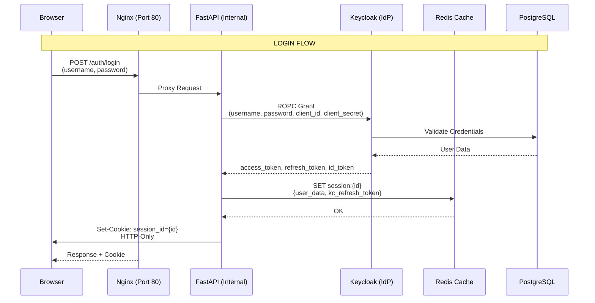
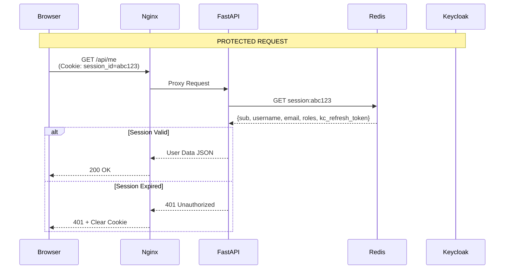
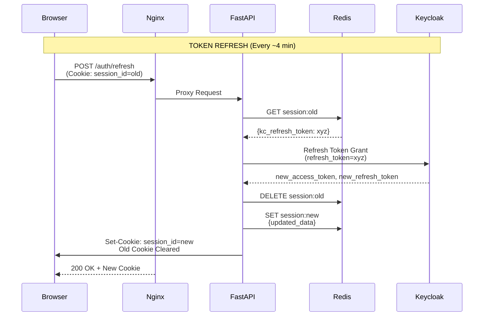
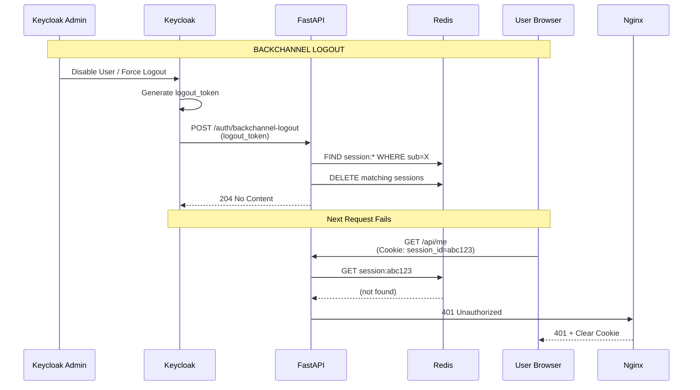
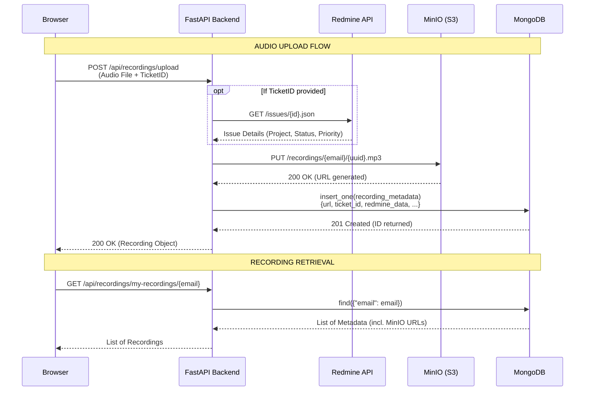
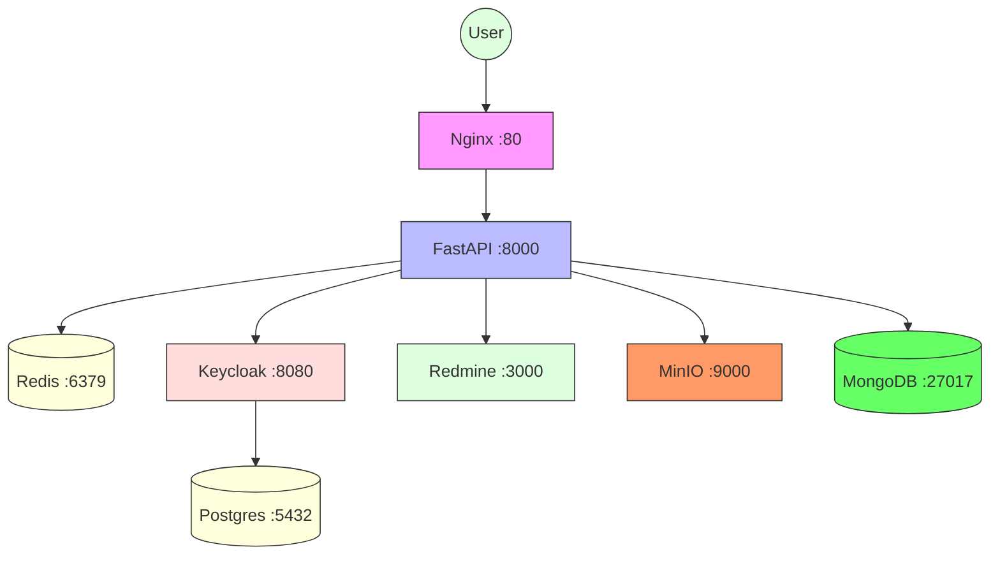
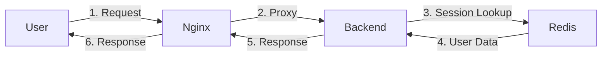

# Backend Architecture Design Document

This document provides a comprehensive overview of the backend architecture, including system components, data flows, deployment topology, and security considerations.

---

## 1. High-Level Architecture Overview

The backend implements a **Backend-for-Frontend (BFF)** pattern with server-side session management. It acts as a secure gateway between frontend clients and external identity providers.

### 1.1 System Topology

```
                                    ┌─────────────────┐
                                    │   Frontend App   │
                                    │   (Browser)      │
                                    └────────┬────────┘
                                             │
                                             │ HTTP Requests
                                             │ (Port 80)
                                             ▼
┌─────────────────────────────────────────────────────────────────────────────────────────────┐
│                              VPS / VM                                                       │
│  ┌──────────────────────────────────────────────────────────────────────────────────┐       │
│  │                                                                                  │       │
│  │    ┌─────────────┐                                                                │       │
│  │    │   Nginx     │ ◄──── Public Entry Point (Port 80)                            │       │
│  │    │ Reverse     │                                                                │       │
│  │    │   Proxy     │                                                                │       │
│  │    └──────┬──────┘                                                                │       │
│  │           │                                                                       │       │
│  │           │ Proxy All Requests                                                    │       │
│  │           ▼                                                                       │       │
│  │    ┌─────────────┐                                                                │       │
│  │    │   FastAPI   │ ◄──── BFF Backend (Port 8000)                                  │       │
│  │    │   Backend   │         (Internal Only)                                        │       │
│  │    └──────┬──────┘                                                                │       │
│  │           │                                                                       │       │
│  │    ┌──────┴──────┬──────────┬───────────┬───────────┬───────────┬───────────┐      │       │
│  │    │             │          │           │           │           │           │      │       │
│  │    ▼             ▼          ▼           ▼           ▼           ▼           ▼      │       │
│  │ ┌──────┐  ┌────────────┐ ┌────────┐ ┌──────────┐ ┌────────┐ ┌──────────┐ ┌────────┐  │       │
│  │ │Redis │  │  Keycloak  │ │Redmine │ │Postgres │ │ MinIO  │ │ MongoDB  │ │Redmine │  │       │
│  │ │Cache │  │    (IdP)   │ │  (PM)  │ │   (DB)   │ │(Object)│ │(Metadata)│ │ (API)  │  │       │
│  │ └──────┘  └────────────┘ └────────┘ └──────────┘ └────────┘ └──────────┘ └────────┘  │       │
│  │    │           │            │           │           │           │           │        │       │
│  └────┼───────────┼────────────┼───────────┼───────────┼───────────┼───────────┼────────┘       │
│       │           │            │           │           │           │           │                │
│       │      127.0.0.1:8080    │      127.0.0.1:5432  127.0.0.1:9000 127.0.0.1:27017            │
│       │      (localhost only)  │                                                                │
│       │           │            │                                                                │
│       └───────────┴────────────┴────────────────────────────────────────────────────────────────┘
                                             │
                                             │ No External Access
                                             │ (Internal Services)
                                             │
                                             ▼
                                    ┌─────────────────┐
                                    │  External Users │
                                    │   (Internet)    │
                                    └─────────────────┘
```

### 1.2 Service Ports and Exposure

| Service     | Port         | External Access | Purpose                        |
|-------------|--------------|------------------|--------------------------------|
| Nginx       | 80           | Yes (Public)     | Reverse proxy, entry point    |
| Backend     | 8000         | No (Internal)   | FastAPI application           |
| Keycloak    | 8080         | No (Localhost)  | Identity & Access Management  |
| Redis       | 6379         | No (Localhost)  | Session cache                |
| Redmine     | 3000         | No (Localhost)  | Project management           |
| PostgreSQL  | 5432         | No (Internal)   | Database for Keycloak/Redmine |
| MinIO       | 9000 / 9001  | No (Localhost)  | Object Storage (S3 API)        |
| MongoDB     | 27017        | No (Localhost)  | NoSQL Metadata Storage        |

### 1.3 Technology Stack

| Layer           | Technology                          |
|----------------|-------------------------------------|
| Reverse Proxy  | Nginx 1.25                          |
| API Framework  | FastAPI 0.115 + Uvicorn             |
| Language       | Python 3.12                          |
| Session Store  | Redis 7.4 (async)                  |
| Identity Provider | Keycloak 26 (Quarkus)            |
| Primary DB     | PostgreSQL 16                       |
| NoSQL DB       | MongoDB 7.0                         |
| Object Storage | MinIO                               |
| Project Management | Redmine 5.1                   |
| Container      | Docker + Docker Compose            |

---

## 2. Request Flow Diagrams

### 2.1 Authentication Flow (Login)



### 2.2 Protected API Request Flow



### 2.3 Token Refresh Flow



### 2.4 Backchannel Logout Flow



### 2.5 Audio Recording Management Flow

This flow integrates MinIO for binary storage and MongoDB for metadata persistence.



---

## 3. Component Details

### 3.1 Nginx Reverse Proxy

**Purpose**: Single public entry point for all HTTP traffic.

**Configuration** (`infra/nginx/conf.d/default.conf`):
```nginx
server {
    listen 80;
    server_name _;
    client_max_body_size 10M;

    location / {
        resolver 127.0.0.11 valid=10s ipv6=off;
        set $backend_upstream http://backend:8000;
        proxy_pass $backend_upstream;

        # WebSocket Support
        proxy_http_version 1.1;
        proxy_set_header Upgrade $http_upgrade;
        proxy_set_header Connection 'upgrade';

        # Headers Forwarding
        proxy_set_header Host $host;
        proxy_cache_bypass $http_upgrade;
        proxy_set_header X-Real-IP $remote_addr;
        proxy_set_header X-Forwarded-For $proxy_add_x_forwarded_for;
        proxy_set_header X-Forwarded-Proto $scheme;
        proxy_set_header Cookie $http_cookie;
    }
}
```

**Key Features**:
- DNS resolution via Docker internal resolver
- WebSocket upgrade support
- Client IP forwarding
- Cookie passthrough for session management

### 3.2 FastAPI Backend

**Purpose**: BFF layer handling authentication, session management, and API routing.

**Endpoints**:
| Method | Endpoint                    | Description                        |
|--------|-----------------------------|------------------------------------|
| GET    | /                           | API status                         |
| GET    | /health                     | Health check                      |
| GET    | /server-time                | Server timestamp                 |
| POST   | /auth/login                 | User login                        |
| POST   | /auth/refresh              | Token refresh                     |
| POST   | /auth/logout               | User logout                       |
| GET    | /auth/logout               | User logout (GET)                  |
| POST   | /auth/backchannel-logout   | SSO logout callback               |
| POST   | /auth/signup               | User registration                 |
| GET    | /api/me                    | Current user info                |
| GET    | /api/redmine/issues       | List Redmine issues              |
| POST   | /api/redmine/issues       | Create issue                    |
| POST   | /api/recordings/upload    | Upload audio to MinIO + Mongo   |
| GET    | /api/recordings/my-recordings/{email} | List recordings for user |
| POST   | /api/recordings/mark-played | Update playback status        |
| DELETE | /api/recordings/delete-recording | Delete from MinIO + Mongo |
| POST   | /api/location             | Save user location to Mongo     |
| GET    | /api/location/{email}     | Get user location from Mongo    |

**Middleware Stack**:
1. SlowAPI (Rate Limiting)
2. CORS (Cross-Origin)
3. Request Logging
4. Correlation ID

### 3.3 Keycloak (Identity Provider)

**Purpose**: Centralized identity and access management.

**Configuration**:
- Realm: `attendance-app`
- Client: `backend-client`
- Grant Type: Resource Owner Password Credentials (ROPC)
- Sessions: Server-side via refresh tokens
- Logout: Support for backchannel logout

**Port Binding**: `127.0.0.1:8080` (localhost only)

### 3.4 Redis (Session Store)

**Purpose**: Fast in-memory session storage.

**Session Structure**:
```json
{
    "sub": "user-uuid",
    "username": "johndoe",
    "email": "john@example.com",
    "roles": ["user", "admin"],
    "kc_refresh_token": "refresh-token-from-keycloak"
}
```

**Key Format**: `session:{random_session_id}`

**TTL**: 24 hours (configurable)

**Port Binding**: `127.0.0.1:6379` (localhost only)

### 3.5 Redmine (Project Management)

**Purpose**: Project tracking and issue management integration.

**Integration**: Backend calls Redmine REST API with API key authentication.

**Synced on Signup**: New users created in Keycloak are asynchronously created in Redmine.

### 3.6 MinIO (Object Storage)

**Purpose**: Secure storage for binary assets (audio recordings, attachments).

**Key Features**:
- S3-compatible API.
- Files organized by user email prefixes: `recordings/{email}/{uuid}.ext`.
- Accessible only via backend-generated URLs or internal proxy.

**Internal Endpoint**: `http://minio:9000`

### 3.7 MongoDB (Metadata Storage)

**Purpose**: Flexible storage for complex metadata and feature-specific data.

**Usage**:
- **Recordings**: Stores recording metadata, Redmine association details, and playback status.
- **Leaves**: Manages leave applications and history.
- **Locations**: Stores real-time or last-known user GPS coordinates.

**Internal Endpoint**: `mongodb://mongodb:27017`

---

## 4. Security Architecture

### 4.1 Network Isolation

```
┌─────────────────────────────────────────────────────────────┐
│                        Public Internet                      │
└─────────────────────────┬───────────────────────────────────┘
                          │
                    Port 80 Only
                          │
                          ▼
┌─────────────────────────────────────────────────────────────┐
│                      VPS / VM                               │
│  ┌─────────────────────────────────────────────────────┐    │
│  │ Docker Network (infra-network)                       │    │
│  │                                                     │    │
│  │   Exposed: Nginx :80                                 │    │
│  │   Internal: Backend :8000                            │    │
│  │   Internal: Keycloak :8080, Redis :6379              │    │
│  │   Internal: Postgres :5432, MongoDB :27017           │    │
│  │   Internal: MinIO :9000, Redmine :3000               │    │
│  └─────────────────────────────────────────────────────┘    │
└─────────────────────────────────────────────────────────────┘
```

### 4.2 Security Measures

| Measure              | Implementation                                       |
|---------------------|-----------------------------------------------------|
| No Public IdP       | Keycloak bound to 127.0.0.1:8080                   |
| No Public Cache     | Redis bound to 127.0.0.1:6379                      |
| No Public DBs       | MongoDB/Postgres not exposed to external traffic   |
| No Public Storage   | MinIO console/API restricted to internal/localhost |
| No JWT in Browser  | Sessions stored server-side, only session_id in cookie |
| HTTP-Only Cookie   | JavaScript cannot access session cookie             |
| Session Rotation   | New session ID on every refresh                   |
| CSRF Protection    | SameSite=lax cookie                               |
| Secure Cookie      | HTTPS only in production                           |
| Rate Limiting      | 100 req/sec per IP (configurable)                 |
| Backchannel Logout | Keycloak can invalidate all sessions             |

### 4.3 Cookie Security

```python
response.set_cookie(
    key="session_id",
    value=session_id,
    httponly=True,        # Cannot access via JavaScript
    secure=True,          # HTTPS only in production
    samesite="lax",      # CSRF protection
    max_age=86400,       # 24 hours
    path="/",
)
```

---

## 5. Deployment Architecture

### 5.1 Docker Compose Structure

```
infra/
├── docker-compose.yml              # Root orchestrator (includes all)
├── .env                         # Shared environment variables
│
├── backend/
│   ├── docker-compose.yml       # Backend service
│   ├── Dockerfile
│   └── .env
│
├── nginx/
│   ├── docker-compose.yml       # Nginx service
│   ├── Dockerfile
│   ├── conf.d/
│   │   └── default.conf      # Reverse proxy config
│   └─��� .env
│
├── keycloak/
│   ├── docker-compose.yml       # Keycloak service
│   ├── Dockerfile
│   └── .env
│
├── redis/
│   ├── docker-compose.yml       # Redis service
│   ├── Dockerfile
│   └── .env
│
└── redmine/
    ├── docker-compose.yml       # Redmine service
    ├── Dockerfile
    └── .env
```

### 5.2 Startup Order

```
keycloak-db (Postgres) ──[healthy]──► Keycloak
         │
         └─────────────────────────► Redis
         │
         └─────────────────────────► Backend
         │
         └─────────────────────────► Nginx
```

### 5.3 Health Checks

| Service     | Check                              |
|------------|------------------------------------|
| keycloak-db| `pg_isready`                      |
| keycloak   | `curl http://localhost:8080/health`|
| redis      | Redis ping                         |
| backend    | `GET /health`                    |
| nginx      | Port 80 open                     |

---

## 6. API Reference

### 6.1 Authentication Endpoints

#### POST /auth/login
```bash
curl -X POST http://localhost/auth/login \
  -d "username=johndoe" \
  -d "password=secretpassword"
```

**Response**:
```json
{
  "message": "Login successful",
  "user": {
    "sub": "user-uuid",
    "username": "johndoe",
    "email": "john@example.com",
    "roles": ["user"]
  }
}
```
*Sets `session_id` cookie (HTTP-only)*

#### POST /auth/refresh
```bash
curl -X POST http://localhost/auth/refresh \
  -H "Cookie: session_id=abc123..."
```

**Response**:
```json
{
  "message": "Session refreshed",
  "user": { ... }
}
```
*Creates new session, clears old cookie*

#### POST /auth/logout
```bash
curl -X POST http://localhost/auth/logout \
  -H "Cookie: session_id=abc123..."
```

**Response**:
```json
{
  "message": "Logout successful"
}
```
*Clears session cookie*

#### POST /auth/backchannel-logout
```bash
curl -X POST http://localhost/auth/backchannel-logout \
  -d "logout_token=eyJ..."
```

**Response**: 204 No Content

### 6.2 Protected Endpoints

#### GET /api/me
```bash
curl http://localhost/api/me \
  -H "Cookie: session_id=abc123..."
```

**Response**:
```json
{
  "sub": "user-uuid",
  "username": "johndoe",
  "email": "john@example.com",
  "roles": ["user"]
}
```

### 6.3 Recording Endpoints (MinIO + MongoDB)

#### POST /api/recordings/upload
Uploads an audio file to MinIO and stores metadata in MongoDB.

```bash
curl -X POST http://localhost/api/recordings/upload \
  -F "email=john@example.com" \
  -F "ticketId=12345" \
  -F "audio=@recording.mp3"
```

**Flow**:
1.  Validate file type (audio only).
2.  (Optional) Fetch issue details from Redmine if `ticketId` provided.
3.  Upload binary to MinIO: `recordings/{email}/{uuid}.mp3`.
4.  Store metadata + MinIO URL + Redmine info in MongoDB.

**Response**:
```json
{
  "id": "mongo-object-id",
  "email": "john@example.com",
  "ticket_id": "12345",
  "recording_url": "http://minio:9000/recordings/john@example.com/uuid.mp3",
  "project": "Project Name",
  "status": "In Progress",
  "created_at": "2026-05-11T09:23:00Z"
}
```

#### GET /api/recordings/my-recordings/{email}
Retrieves all recordings metadata for a specific user from MongoDB.

**Response**:
```json
[
  {
    "id": "...",
    "filename": "meeting.mp3",
    "recording_url": "...",
    "is_played": false
  }
]
```

#### DELETE /api/recordings/delete-recording
Deletes the binary from MinIO and the metadata from MongoDB.

```bash
curl -X DELETE http://localhost/api/recordings/delete-recording \
  -d '{"email": "john@example.com", "recordingUrl": "..."}'
```

### 6.4 Location Endpoints (MongoDB)

#### POST /api/location
Updates the user's last known location. Uses `upsert` in MongoDB to maintain one record per email.
**Protection**: Requires valid session cookie. Users can only update their own location unless they have the `admin` role.

```bash
curl -X POST http://localhost/api/location \
  -H "Content-Type: application/json" \
  -H "Cookie: session_id=..." \
  -d '{
    "email": "test@gmail.com",
    "latitude": 28.6139,
    "longitude": 77.2090
  }'
```

**Response**:
```json
{
  "email": "test@gmail.com",
  "latitude": 28.6139,
  "longitude": 77.2090,
  "updated_at": "2026-05-11T10:56:30Z"
}
```

#### GET /api/location/{email}
Retrieves the location data for a specific user.
**Protection**: Requires valid session cookie.

**Response**:
```json
{
  "email": "test@gmail.com",
  "latitude": 28.6139,
  "longitude": 77.2090,
  "updated_at": "..."
}
```

---

## 7. Monitoring and Logging

### 7.1 Log Files

| Log File          | Location                        |
|-----------------|---------------------------------|
| Access Log      | `apps/backend/logs/access.log`   |
| Error Log      | `apps/backend/logs/error.log`    |
| Audit Log      | `apps/backend/logs/audit.log`    |

### 7.2 Audit Events

| Event Type      | When                               |
|---------------|------------------------------------|
| login         | User login attempt                |
| logout        | User logout                       |
| session_refresh | Token refresh                   |
| backchannel_logout | SSO logout                   |
| security_event   | Suspicious activity            |

### 7.3 Correlation ID

Every request receives a correlation ID for distributed tracing:
```
X-Correlation-ID: abc-123-def-456
```

---

## 8. Folder Structure

```
backend-monorepo/
├── apps/
│   └── backend/
│       ├── app/
│       │   ├── main.py                 # FastAPI app factory
│       │   ├── core/                  # Configuration
│       │   │   ├── config.py         # Settings
│       │   │   ├── database.py      # DB connection
│       │   │   ├── lifespan.py    # Lifecycle
│       │   │   ├── limiter.py     # Rate limiting
│       │   │   └── logging.py      # Logging setup
│       │   ├── features/
│       │   │   ├── auth/           # Authentication
│       │   │   │   ├── routes.py
│       │   │   │   ├── dependencies.py
│       │   │   │   ├── schemas.py
│       │   │   │   └── services/
│       │   │   │       ├── session.py
│       │   │   │       └── keycloak.py
│       │   │   └── redmine/       # Redmine integration
│       │   │       ├── routes.py
│       │   │       ├── service.py
│       │   │       └── schemas.py
│       │   ├── middleware/          # HTTP middleware
│       │   │   ├── logging.py
│       │   │   └── correlation.py
│       │   ├── models/            # ORM models
│       │   ├── schemas/           # Pydantic schemas
│       │   └── utils/             # Utilities
│       │       ├── jwt.py
│       │       └── audit.py
│       ├── Dockerfile
│       ├── pyproject.toml
│       └── uv.lock
│
├── infra/
│   ├── docker-compose.yml
│   ├── .env
│   ├── backend/
│   ├── nginx/
│   │   ├── conf.d/
│   │   │   └── default.conf
│   ├── keycloak/
│   ├── redis/
│   └── redmine/
│
├── docs/
│   ├── architecture.md          # This document
│   ├── auth_flow.md
│   ├── testing_guideline.md
│   └── ...
│
├── package.json
├── pnpm-workspace.yaml
├── turbo.json
└── README.md
```

---

## 9. Environment Variables

### 9.1 Backend (.env)

| Variable                | Default                              | Description              |
|-------------------------|--------------------------------------|--------------------------|
| KEYCLOAK_URL            | http://keycloak:8080                 | Keycloak server          |
| REALM                   | attendance-app                       | Keycloak realm          |
| KEYCLOAK_CLIENT_ID      | backend-client                       | OAuth client ID         |
| KEYCLOAK_CLIENT_SECRET  | ...                                  | OAuth client secret     |
| SECRET_KEY              | ...                                  | JWT signing key         |
| SESSION_EXPIRE_HOURS     | 24                                   | Session TTL             |
| REDIS_URL               | redis://redis:6379                   | Redis connection        |
| CORS_ORIGINS            | [...]                               | Allowed origins        |
| RATE_LIMIT_PER_SECOND   | 100                                  | Requests per second     |
| REDMINE_URL             | http://redmine:3000                   | Redmine server           |
| REDMINE_API_KEY         | ...                                  | Redmine API key        |
| MINIO_URL               | http://minio:9000                    | MinIO server           |
| MINIO_ACCESS_KEY        | ...                                  | S3 Access Key          |
| MINIO_SECRET_KEY        | ...                                  | S3 Secret Key          |
| MINIO_BUCKET_NAME       | recordings                           | S3 Bucket              |
| MONGO_URL               | mongodb://mongodb:27017              | MongoDB Connection     |
| MONGO_DB_NAME           | attendance_db                        | MongoDB Database       |

### 9.2 Shared (.env)

| Variable                    | Description                    |
|----------------------------|---------------------------------|
| POSTGRES_DB                | Database name                   |
| POSTGRES_USER              | Database user                 |
| POSTGRES_PASSWORD          | Database password             |
| KEYCLOAK_ADMIN            | Keycloak admin username      |
| KEYCLOAK_ADMIN_PASSWORD   | Keycloak admin password       |

---

## 10. Troubleshooting

### 10.1 Common Issues

| Issue                       | Solution                                      |
|----------------------------|-----------------------------------------------|
| 401 on protected endpoint | Check session cookie, try /auth/login          |
| 429 Too Many Requests      | Rate limit exceeded, wait before retry       |
| Nginx 502 Bad Gateway    | Backend not running, check backend health  |
| Keycloak connection fail | Check KEYCLOAK_URL, verify Keycloak is up  |
| Redis connection fail     | Check REDIS_URL, verify Redis is running      |

### 10.2 Health Check Commands

```bash
# Check all services
docker compose ps

# Check backend health
curl http://localhost/health

# Check Keycloak health
curl http://127.0.0.1:8080/health

# Check Redis
docker compose exec redis redis-cli ping
```

---

## 11. Networking Management

### 11.1 Docker Network Topology
The system utilizes a unified Docker bridge network named `infra-network` for all components. This architecture ensures:
- **Service Discovery**: Services communicate via internal DNS names (e.g., `http://backend:8000`, `http://keycloak:8080`).
- **Isolation**: Internal services (Redis, Keycloak, Postgres) are not reachable from the public internet, reducing the attack surface.

### 11.2 Traffic Segmentation
- **External Traffic**: Only the Nginx container (Port 80) is exposed to the host's public IP.
- **Localhost-Only Access**: Keycloak and Redis are mapped to `127.0.0.1` on the host for administrative access and debugging, but remain inaccessible to external clients.
- **Internal Backchannel**: The communication between the FastAPI backend and Keycloak (for token exchange) or Redis (for session storage) happens entirely within the Docker virtual network.

### 11.3 CORS and Origin Management
Cross-Origin Resource Sharing (CORS) is strictly controlled within the FastAPI application:
- **Allowed Origins**: Configured via the `CORS_ORIGINS` environment variable, specifically targeting trusted frontend domains (e.g., `http://localhost:5173`, `http://95.216.39.97:8086`).
- **Session Credentials**: The backend is configured to allow credentials (`allow_credentials=True`), enabling the secure transmission of HTTP-only session cookies.

### 11.4 Proxy and Upstream Resolution
Nginx is configured as a robust reverse proxy:
- **Dynamic Upstream**: Uses `resolver 127.0.0.11` (Docker's DNS) to resolve the backend service.
- **Header Preservation**: Forwards essential headers (`X-Real-IP`, `X-Forwarded-For`, `X-Forwarded-Proto`) to the backend to ensure correct logging and protocol detection.
- **Cookie Passthrough**: Transparently forwards the `session_id` cookie between the client and the BFF layer.

---

## Appendix A: Mermaid Diagrams Source

### A.1 Architecture Diagram


### A.2 Request Flow Diagram


---

*Document Version: 1.1*  
*Last Updated: 2026-05-06*